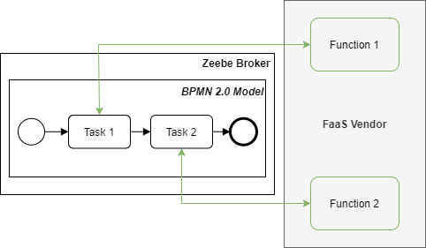
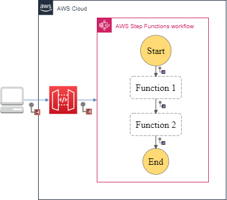

<link href="prism.css" rel="stylesheet" />

## Table of Contents
- [Table of Contents](#table-of-contents)
- [Patterns](#patterns)
  - [**Process Manager**](#process-manager)
  - [**Event and Document Message**](#event-and-document-message)
  - [**Message Endpoint**](#message-endpoint)
  - [**Pipes and Filters**](#pipes-and-filters)
  - [**Multicast**](#multicast)
  - [**Content-based Router**](#content-based-router)
  - [**Loop**](#loop)
  - [**Delay**](#delay)
  - [**Gateway**](#gateway)
  - [**Content Filter**](#content-filter)
  - [**Content Enricher**](#content-enricher)
  - [**Claim Check**](#claim-check)
  - [**Normalizer**](#normalizer)
  - [**Message History**](#message-history)
  - [**Splitter and Aggregator**](#splitter-and-aggregator)
  - [**Implicit termination**](#implicit-termination)
  - [**Nested Workflows**](#nested-workflows)
  - [**Callback**](#callback)
  - [**Error Handling**](#error-handling)
  - [**Workflow Data**](#workflow-data)
- [References](#references)

## Patterns

### **Process Manager**

**Problem**: How does the serverless workflow determine the path in which the message needs to flow if it consists of multiple functions and conditions?

**Decision**: The _Process Manager_ acts as a central processing component for the system. As workflows are influenced by each step's output message, execution states need to be maintained, and based on the result; the succeeding component is invoked.

**Source**: [[Hohpe and Woolf 2004]](#1)

**Pattern**: Enterprise Integration Pattern

**Type**: Construct

**Synonyms**: -

**Mapping**:

<b>AWS Step Functions</b>

<!-- <iframe src="aws_step_functions\process_manager.html"></iframe> -->
States can be orchestrated using ASF State Machine.
 

    

 
<b>ASF snippet</b>:
 
<pre>
  <code>
    {
    "Comment": "ASF Template",
    "StartAt": "Function",
    "States": {
        "Function": {
        "Type": "Pass",
        "End": true
        }
    }
    }
  </code>
</pre>

<b>Zeebe</b>

The "Process Manager" pattern for Zeebe is the broker coordinating the various tasks in the workflow. Here the various tasks are associated with their corresponding hosted function.
 

    

<b>Azure Durable Functions</b>

Here the message routing "Process Manager" pattern for ADF is presented. Here the various functions are orchestrated using the primary Orchestration Function.
 

    

 

----

 

### **Event and Document Message**

**Problem**: How can the serverless workflow and its involved functions be executed/triggered?

**Decision**: External services or clients can invoke the serverless data processing workflow by an _Event Message_. Furthermore, _Event Messages_ can be used to invoke other workflows or services. As functions are considered a black box, the _Document Message_ containing the data structure message is the most optimum choice when communicating between internal states/functions.

**Source**: [[Hohpe and Woolf 2004]](#1)

**Pattern**: Enterprise Integration Pattern

**Type**: Construct

**Synonyms**: -

**Mapping**:

<b>AWS Step Functions</b>

ASF can be triggered using an event message via the API Gateway<a href="#1" id="1">1</a>. The various states in ASF are traversed using a document message that is a JSON structured message.
 

    

<b>Zeebe</b>

In Zeebe, the Event and Document message constructs invoke the workflow and handle the internal communication between elements, respectively. A client can invoke the intermediatory Zeebe client, which in turn invokes the BPMN 2.0 Zeebe workflow via gRPC. Internally, the workflow uses variables and JSON messages to interact with the states.
 

    

<b>Azure Durable Functions</b>

In ADF, the Event message construct invokes the orchestration function, and the Document message handles the internal message communication between the functions.
 

    

 

----

 

### **Message Endpoint**

**Problem**: How are various functions in a serverless workflow connected?

**Decision**: With the _Message Endpoint_ construct, the various functions do not need to be aware of the message formats, channel, or other functions present in the serverless workflow. The functions only need to be mindful that they will receive requests, and it just needs to process and send the acknowledgment/response back to the system

**Source**: [[Hohpe and Woolf 2004]](#1)

**Pattern**: Enterprise Integration Pattern

**Type**: Construct

**Synonyms**: -

**Mapping**:

<b>AWS Step Functions</b>

ASF can be triggered using an event message via the API Gateway<a href="#1" id="1">1</a>. The various states in ASF are traversed using a document message that is a JSON structured message.
 

    

<b>Zeebe</b>

In Zeebe, the Event and Document message constructs invoke the workflow and handle the internal communication between elements, respectively. A client can invoke the intermediatory Zeebe client, which in turn invokes the BPMN 2.0 Zeebe workflow via gRPC. Internally, the workflow uses variables and JSON messages to interact with the states.
 

    

<b>Azure Durable Functions</b>

In ADF, the Event message construct invokes the orchestration function, and the Document message handles the internal message communication between the functions.
 

    

 

----

 

### **Pipes and Filters**

**Problem**: How to decompose a task that performs complex processing into a series of separate elements that can be reused?

**Decision**: _Pipes and Filters_ help in implementing complex processing in a granular, independent, resilient and sequential manner. Moreover, the fundamental building blocks of serverless workflows are functions, and each function in the pipeline is generally responsible for small transactions making this pattern style optimum.

**Source**: [[Hohpe and Woolf 2004]](#1)

**Pattern**: Enterprise Integration Pattern

**Type**: Construct

**Synonyms**: Sequence, Sequential routing, Serial Routing

**Mapping**:

<b>AWS Step Functions</b>

ASF can be triggered using an event message via the API Gateway<a href="#1" id="1">1</a>. The various states in ASF are traversed using a document message that is a JSON structured message.
 

    

<b>Zeebe</b>

In Zeebe, the Event and Document message constructs invoke the workflow and handle the internal communication between elements, respectively. A client can invoke the intermediatory Zeebe client, which in turn invokes the BPMN 2.0 Zeebe workflow via gRPC. Internally, the workflow uses variables and JSON messages to interact with the states.
 

    

<b>Azure Durable Functions</b>

In ADF, the Event message construct invokes the orchestration function, and the Document message handles the internal message communication between the functions.
 

    

 

----

 

### **Multicast**

**Problem**: How will the serverless workflow route the same message to several endpoints and process them differently?

**Decision**: A _Multicast_ pattern is used to model the execution of parallel flows/concurrency by sending a copy of the same message to multiple recipients without checking any conditions. Here all outgoing flows are executed at the same time.

**Source**: [[Ibsen and Anstey 2010]](#2)

**Pattern**: Enterprise Integration Pattern

**Type**: Control Flow

**Synonyms**: Parallel Split, AND-Split, Parallel Routing, Fork

**Mapping**:

<b>AWS Step Functions</b>

ASF can be triggered using an event message via the API Gateway<a href="#1" id="1">1</a>. The various states in ASF are traversed using a document message that is a JSON structured message.
 

    

<b>Zeebe</b>

In Zeebe, the Event and Document message constructs invoke the workflow and handle the internal communication between elements, respectively. A client can invoke the intermediatory Zeebe client, which in turn invokes the BPMN 2.0 Zeebe workflow via gRPC. Internally, the workflow uses variables and JSON messages to interact with the states.
 

    

<b>Azure Durable Functions</b>

In ADF, the Event message construct invokes the orchestration function, and the Document message handles the internal message communication between the functions.
 

    

 

----

 

### **Content-based Router**

**Problem**: Functions must be orchestrated to adhere to a process flow to generate an error-free/desired output. How can the messages be routed to the correct workflow execution path within the workflow based on the message content?

**Decision**:  A _Content-based Router_ helps in controlling the workflow based on the message content. Each outgoing flow connected from the router corresponds to a condition, and the flow with the satisfied condition is traversed. Based on the condition, one or many flows can be traversed. In this pattern, the router examines the message content using numerous criteria like fields, values, and conditions before routing to the appropriate path.

**Source**: [[Hohpe and Woolf 2004]](#1)

**Pattern**: Enterprise Integration Pattern

**Type**: Control Flow

**Synonyms**: Exclusive Choice, XOR-Split, Conditional Routing, Switch, Decision, Selection and OR-Split

**Mapping**:

<b>AWS Step Functions</b>

ASF can be triggered using an event message via the API Gateway<a href="#1" id="1">1</a>. The various states in ASF are traversed using a document message that is a JSON structured message.
 

    

<b>Zeebe</b>

In Zeebe, the Event and Document message constructs invoke the workflow and handle the internal communication between elements, respectively. A client can invoke the intermediatory Zeebe client, which in turn invokes the BPMN 2.0 Zeebe workflow via gRPC. Internally, the workflow uses variables and JSON messages to interact with the states.
 

    

<b>Azure Durable Functions</b>

In ADF, the Event message construct invokes the orchestration function, and the Document message handles the internal message communication between the functions.
 

    

 

----

 

### **Loop**

**Problem**: In a serverless workflow, certain functions have to be executed multiple times to produce the desired outcome. How can the workflow orchestrate a function to be reused when it needs to be triggered recursively?

**Decision**:  The _Loop_ pattern is used to loop through the function multiple times

**Source**: [[Ibsen and Anstey 2010]](#2)

**Pattern**: Enterprise Integration Pattern

**Type**: Control Flow

**Synonyms**: Arbitrary Cycles, Iteration, Cycle

**Mapping**:

<b>AWS Step Functions</b>

ASF can be triggered using an event message via the API Gateway<a href="#1" id="1">1</a>. The various states in ASF are traversed using a document message that is a JSON structured message.
 

    

<b>Zeebe</b>

In Zeebe, the Event and Document message constructs invoke the workflow and handle the internal communication between elements, respectively. A client can invoke the intermediatory Zeebe client, which in turn invokes the BPMN 2.0 Zeebe workflow via gRPC. Internally, the workflow uses variables and JSON messages to interact with the states.
 

    

<b>Azure Durable Functions</b>

In ADF, the Event message construct invokes the orchestration function, and the Document message handles the internal message communication between the functions.
 

    

 

----

 

### **Delay**

**Problem**: There are situations during a workflow execution when it needs to be paused or delayed to wait for a response/acknowledgment from an external system. How can the workflow incorporate a delay or wait?

**Decision**:  The _Delay_ pattern helps in waiting or delaying a function from executing. The delay/wait can be configured by setting a time/period.

**Source**: [[Ibsen and Anstey 2010]](#2)

**Pattern**: Enterprise Integration Pattern

**Type**: Control Flow

**Synonyms**: -

**Mapping**:

<b>AWS Step Functions</b>

ASF can be triggered using an event message via the API Gateway<a href="#1" id="1">1</a>. The various states in ASF are traversed using a document message that is a JSON structured message.
 

    

<b>Zeebe</b>

In Zeebe, the Event and Document message constructs invoke the workflow and handle the internal communication between elements, respectively. A client can invoke the intermediatory Zeebe client, which in turn invokes the BPMN 2.0 Zeebe workflow via gRPC. Internally, the workflow uses variables and JSON messages to interact with the states.
 

    

<b>Azure Durable Functions</b>

In ADF, the Event message construct invokes the orchestration function, and the Document message handles the internal message communication between the functions.
 

    

 

----

 

### **Gateway**

**Problem**: Business and operational/implementation logic must be as decoupled as possible to allow core business logic to remain simple?

**Decision**:  The ingestion and output logic need to be encapsulated in separate functions with the help of _Message Gateway_ pattern and this pattern also helps in dividing messaging-specific implementation from the business logic code.

**Source**: [[Hohpe and Woolf 2004]](#1)

**Pattern**: Enterprise Integration Pattern

**Type**: Function Specific

**Synonyms**: -

**Mapping**:

<b>AWS Step Functions</b>

ASF can be triggered using an event message via the API Gateway<a href="#1" id="1">1</a>. The various states in ASF are traversed using a document message that is a JSON structured message.
 

    

<b>Zeebe</b>

In Zeebe, the Event and Document message constructs invoke the workflow and handle the internal communication between elements, respectively. A client can invoke the intermediatory Zeebe client, which in turn invokes the BPMN 2.0 Zeebe workflow via gRPC. Internally, the workflow uses variables and JSON messages to interact with the states.
 

    

<b>Azure Durable Functions</b>

In ADF, the Event message construct invokes the orchestration function, and the Document message handles the internal message communication between the functions.
 

    

 

----

 

### **Content Filter**

**Problem**: How can the workflow simplify dealing with large messages and transmit only the essential data to the required functions?

**Decision**:  The _Content Filter_ pattern simplifies the structure of the messages by removing irrelevant data.

**Source**: [[Hohpe and Woolf 2004]](#1)

**Pattern**: Enterprise Integration Pattern

**Type**: Function Specific

**Synonyms**: -

**Mapping**:

<b>AWS Step Functions</b>

ASF can be triggered using an event message via the API Gateway<a href="#1" id="1">1</a>. The various states in ASF are traversed using a document message that is a JSON structured message.
 

    

<b>Zeebe</b>

In Zeebe, the Event and Document message constructs invoke the workflow and handle the internal communication between elements, respectively. A client can invoke the intermediatory Zeebe client, which in turn invokes the BPMN 2.0 Zeebe workflow via gRPC. Internally, the workflow uses variables and JSON messages to interact with the states.
 

    

<b>Azure Durable Functions</b>

In ADF, the Event message construct invokes the orchestration function, and the Document message handles the internal message communication between the functions.
 

    

 

----

 

### **Content Enricher**

**Problem**: How can the workflow fetch additional data required by the functions to process the message?

**Decision**:  The _Content Enricher_ pattern accesses external data source and augments the original message with the missing information.

**Source**: [[Hohpe and Woolf 2004]](#1)

**Pattern**: Enterprise Integration Pattern

**Type**: Function Specific

**Synonyms**: -

**Mapping**:

<b>AWS Step Functions</b>

ASF can be triggered using an event message via the API Gateway<a href="#1" id="1">1</a>. The various states in ASF are traversed using a document message that is a JSON structured message.
 

    

<b>Zeebe</b>

In Zeebe, the Event and Document message constructs invoke the workflow and handle the internal communication between elements, respectively. A client can invoke the intermediatory Zeebe client, which in turn invokes the BPMN 2.0 Zeebe workflow via gRPC. Internally, the workflow uses variables and JSON messages to interact with the states.
 

    

<b>Azure Durable Functions</b>

In ADF, the Event message construct invokes the orchestration function, and the Document message handles the internal message communication between the functions.
 

    

 

----

 

### **Claim Check**

**Problem**: Functions that pass large payloads of data within the workflow can be terminated due to size limitations. How will the communication between functions be handled when large messages need to be passed within the workflow?

**Decision**:  Large fields are temporarily filtered in the source function and enriched in the destination function using the _Claim Check_ pattern. The payload is stored in a persistent store, and a _Claim Check_ is passed to the target component. Internally, _Claim Check_ uses the _Content Filter_ and _Content Enricher_ pattern. The _Content Filter_ pattern removes insignificant data from an output message leaving only essential information, thus simplifying its structure. The target function then uses the _Content Enricher_ pattern to augment the received message with the missing information, usually with the help of an external data source.

**Source**: [[Hohpe and Woolf 2004]](#1)

**Pattern**: Enterprise Integration Pattern

**Type**: Function Specific

**Synonyms**: -

**Mapping**:

<b>AWS Step Functions</b>

ASF can be triggered using an event message via the API Gateway<a href="#1" id="1">1</a>. The various states in ASF are traversed using a document message that is a JSON structured message.
 

    

<b>Zeebe</b>

In Zeebe, the Event and Document message constructs invoke the workflow and handle the internal communication between elements, respectively. A client can invoke the intermediatory Zeebe client, which in turn invokes the BPMN 2.0 Zeebe workflow via gRPC. Internally, the workflow uses variables and JSON messages to interact with the states.
 

    

<b>Azure Durable Functions</b>

In ADF, the Event message construct invokes the orchestration function, and the Document message handles the internal message communication between the functions.
 

    

 

----

 

### **Normalizer**

**Problem**: How can the output from each terminal function in the workflow branches be normalized, which otherwise would require having an additional normalization function?

**Decision**:  The _Normalizer_ pattern helps solve this problem by ensuring that the messages produced from any branch confirm with a standard format that is understandable by the recipient component. In this pattern, each message is passed through a custom message translator so that the resulting messages match a standard format. Hence this pattern helps in preventing the creation and invoking of additional functions to handle this scenario.

**Source**: [[Hohpe and Woolf 2004]](#1)

**Pattern**: Enterprise Integration Pattern

**Type**: Function Specific

**Synonyms**: -

**Mapping**:

<b>AWS Step Functions</b>

ASF can be triggered using an event message via the API Gateway<a href="#1" id="1">1</a>. The various states in ASF are traversed using a document message that is a JSON structured message.
 

    

<b>Zeebe</b>

In Zeebe, the Event and Document message constructs invoke the workflow and handle the internal communication between elements, respectively. A client can invoke the intermediatory Zeebe client, which in turn invokes the BPMN 2.0 Zeebe workflow via gRPC. Internally, the workflow uses variables and JSON messages to interact with the states.
 

    

<b>Azure Durable Functions</b>

In ADF, the Event message construct invokes the orchestration function, and the Document message handles the internal message communication between the functions.
 

    

 

----

 

### **Message History**

**Problem**: How can we effectively analyze and debug the flow of messages in a loosely coupled and granular system?

**Decision**:  The primary purpose of employing a serverless paradigm is to build loosely coupled and granular systems. However, building such systems induces the complexity of debugging and traceability as it is not intuitively possible to comprehend the flow of the message. This problem can be solved using the _Message History_ pattern, in which the system maintains the history of the message. Thus when a message fails to be processed in the system, the developer can trace back the steps and provide instant feedback and solution.

**Source**: [[Hohpe and Woolf 2004]](#1)

**Pattern**: Enterprise Integration Pattern

**Type**: Function Specific

**Synonyms**: -

**Mapping**:

<b>AWS Step Functions</b>

ASF can be triggered using an event message via the API Gateway<a href="#1" id="1">1</a>. The various states in ASF are traversed using a document message that is a JSON structured message.
 

    

<b>Zeebe</b>

In Zeebe, the Event and Document message constructs invoke the workflow and handle the internal communication between elements, respectively. A client can invoke the intermediatory Zeebe client, which in turn invokes the BPMN 2.0 Zeebe workflow via gRPC. Internally, the workflow uses variables and JSON messages to interact with the states.
 

    

<b>Azure Durable Functions</b>

In ADF, the Event message construct invokes the orchestration function, and the Document message handles the internal message communication between the functions.
 

    

 

----

 

### **Splitter and Aggregator**

**Problem**: How can the serverless workflow process multiple homogeneous records concurrently that are part of a single payload?

**Decision**:  A _Splitter_ pattern helps split a single message into a sequence of sub-messages that can be processed individually. Likewise, the _Aggregator_ pattern performs the contrary by collecting a complete set of related messages. Combining the two patterns simulates the MapReduce<a href="#2" id="2">2</a> implementation, which can be used to split the array payload into smaller chunks that be processed in a parallel fashion and, more importantly, avoid payload limit issues.

**Source**: [[Hohpe and Woolf 2004]](#1)

**Pattern**: Enterprise Integration Pattern

**Type**: Function Specific

**Synonyms**: Fan-out, Fan-in

**Mapping**:

<b>AWS Step Functions</b>

ASF can be triggered using an event message via the API Gateway<a href="#1" id="1">1</a>. The various states in ASF are traversed using a document message that is a JSON structured message.
 

    

<b>Zeebe</b>

In Zeebe, the Event and Document message constructs invoke the workflow and handle the internal communication between elements, respectively. A client can invoke the intermediatory Zeebe client, which in turn invokes the BPMN 2.0 Zeebe workflow via gRPC. Internally, the workflow uses variables and JSON messages to interact with the states.
 

    

<b>Azure Durable Functions</b>

In ADF, the Event message construct invokes the orchestration function, and the Document message handles the internal message communication between the functions.
 

    

 

----

 

### **Implicit termination**

**Problem**: How to terminate the workflow when no execution steps are remaining?

**Decision**:  The _Implicit Termination_ pattern states that if there is no task to be performed, stop the workflow

**Source**: [[Russell et al. 2006a]](#3), [[van der Aalst et al. 2003]](#4)

**Pattern**: Workflow Control-Flow Pattern

**Type**: Control Flow

**Synonyms**: -

**Mapping**:

<b>AWS Step Functions</b>

ASF can be triggered using an event message via the API Gateway<a href="#1" id="1">1</a>. The various states in ASF are traversed using a document message that is a JSON structured message.
 

    

<b>Zeebe</b>

In Zeebe, the Event and Document message constructs invoke the workflow and handle the internal communication between elements, respectively. A client can invoke the intermediatory Zeebe client, which in turn invokes the BPMN 2.0 Zeebe workflow via gRPC. Internally, the workflow uses variables and JSON messages to interact with the states.
 

    

<b>Azure Durable Functions</b>

In ADF, the Event message construct invokes the orchestration function, and the Document message handles the internal message communication between the functions.
 

    

 

----

 

### **Nested Workflows**

**Problem**: If some tasks are alike, how do we abstract and represent them as a hierarchical and reusable model?

**Decision**:  _Nested Workflows_ patterns help facilitate reusable workflows, abstracting complex logic, effective communication, and hierarchical and modular modeling.

**Source**: [[Russell et al. 2006a]](#3), [[van der Aalst et al. 2003]](#4)

**Pattern**: Workflow Control-Flow Pattern

**Type**: Control Flow

**Synonyms**: Sub-workflow

**Mapping**:

<b>AWS Step Functions</b>

ASF can be triggered using an event message via the API Gateway<a href="#1" id="1">1</a>. The various states in ASF are traversed using a document message that is a JSON structured message.
 

    

<b>Zeebe</b>

In Zeebe, the Event and Document message constructs invoke the workflow and handle the internal communication between elements, respectively. A client can invoke the intermediatory Zeebe client, which in turn invokes the BPMN 2.0 Zeebe workflow via gRPC. Internally, the workflow uses variables and JSON messages to interact with the states.
 

    

<b>Azure Durable Functions</b>

In ADF, the Event message construct invokes the orchestration function, and the Document message handles the internal message communication between the functions.
 

    

 

----

 

### **Callback**

**Problem**: How can the serverless workflow handle external invocations from a service or a human-performed activity?

**Decision**:  In the _Callback_ pattern, the workflow pauses execution and waits until an appropriate response is received to proceed with the execution. These tasks can be human, service, or some response from an external process.

**Source**: [[Russell et al. 2006a]](#3), [[van der Aalst et al. 2003]](#4)

**Pattern**: Workflow Control-Flow Pattern

**Type**: Control Flow / Function Specific

**Synonyms**: -

**Mapping**:

<b>AWS Step Functions</b>

ASF can be triggered using an event message via the API Gateway<a href="#1" id="1">1</a>. The various states in ASF are traversed using a document message that is a JSON structured message.
 

    

<b>Zeebe</b>

In Zeebe, the Event and Document message constructs invoke the workflow and handle the internal communication between elements, respectively. A client can invoke the intermediatory Zeebe client, which in turn invokes the BPMN 2.0 Zeebe workflow via gRPC. Internally, the workflow uses variables and JSON messages to interact with the states.
 

    

<b>Azure Durable Functions</b>

In ADF, the Event message construct invokes the orchestration function, and the Document message handles the internal message communication between the functions.
 

    

 

----

 

### **Error Handling**

**Problem**: How can the system handle error exceptions that might occur in the workflow and manage them gracefully?

**Decision**:  The _Error Handling_ pattern helps handle exceptions due to abnormal input or conditions and can retry the processing when needed.

**Source**: [[Russell et al. 2006a]](#3)

**Pattern**: Workflow Control-Flow Pattern

**Type**: Control Flow / Function Specific

**Synonyms**: -

**Mapping**:

<b>AWS Step Functions</b>

ASF can be triggered using an event message via the API Gateway<a href="#1" id="1">1</a>. The various states in ASF are traversed using a document message that is a JSON structured message.
 

    

<b>Zeebe</b>

In Zeebe, the Event and Document message constructs invoke the workflow and handle the internal communication between elements, respectively. A client can invoke the intermediatory Zeebe client, which in turn invokes the BPMN 2.0 Zeebe workflow via gRPC. Internally, the workflow uses variables and JSON messages to interact with the states.
 

    

<b>Azure Durable Functions</b>

In ADF, the Event message construct invokes the orchestration function, and the Document message handles the internal message communication between the functions.
 
<pre>
  <code>

    const df = require("durable-functions");

    module.exports = df.orchestrator(function* (context) {
        try {
            const function1 = yield context.df.callActivity("function1", context.df.getInput())
            return function1;
        }
        catch (error) {
            console.error(error)
        }
    });
  </code>
</pre>

 

----

 

### **Workflow Data**

**Problem**:

- Sharing external and internal dependencies so that code duplication can be kept to the bare minimum and prevent maintainability issues.
- Reduce the size of your deployment package.
- Ensure the usage of common versions of dependencies/data between various components.

**Decision**:  The _Workflow Data_ pattern states that the data required for the whole workflow will be available to all functions. In this pattern, the shared libraries and packages are placed under the appropriate directory or vendor-specific offerings.

**Source**: [[Russell et al. 2005]](#5)

**Pattern**: Workflow Data Pattern

**Type**: Function Specific

**Synonyms**: -

**Mapping**:

<b>AWS Step Functions</b>

ASF can be triggered using an event message via the API Gateway<a href="#1" id="1">1</a>. The various states in ASF are traversed using a document message that is a JSON structured message.
 

    

<b>Zeebe</b>

In Zeebe, the Event and Document message constructs invoke the workflow and handle the internal communication between elements, respectively. A client can invoke the intermediatory Zeebe client, which in turn invokes the BPMN 2.0 Zeebe workflow via gRPC. Internally, the workflow uses variables and JSON messages to interact with the states.
 

    

<b>Azure Durable Functions</b>

The Workflow Data pattern is function-specific, and sharing utilities, libraries, and helper code can be done by placing all these compiled files in a folder at the root level of the functions.
 

    

 

----

 

## References

<a id="1">[Hohpe and Woolf 2004]</a>
Hohpe, G. and Woolf, B., 2004. Enterprise integration patterns: Designing, building, and deploying messaging solutions. Addison-Wesley Professional.

<a id="2">[Ibsen and Anstey 2010]</a>
Ibsen, C. and Anstey, J., 2018. Camel in action. Simon and Schuster.

<a id="3">[Russell et al. 2006a]</a>
Russell, N., Ter Hofstede, A.H., Van Der Aalst, W.M. and Mulyar, N., 2006. Workflow control-flow patterns: A revised view. BPM Center Report BPM-06-22, BPMcenter. org, pp.06-22.

<a id="4">[van der Aalst et al. 2003]</a>
van Der Aalst, W.M., Ter Hofstede, A.H., Kiepuszewski, B. and Barros, A.P., 2003. Workflow patterns. Distributed and parallel databases, 14(1), pp.5-51.

<a id="5">[Russell et al. 2005]</a>
Russell, N., Ter Hofstede, A.H., Edmond, D. and Van der Aalst, W.M., 2005, October. Workflow data patterns: Identification, representation and tool support. In International Conference on Conceptual Modeling (pp. 353-368). Springer, Berlin, Heidelberg.

***
<a href="https://aws.amazon.com/api-gateway" title="AWS API Gateway">1. https://aws.amazon.com/api-gateway</a>

<a href="https://en.wikipedia.org/wiki/MapReduce" title="MapReduce">2. https://en.wikipedia.org/wiki/MapReduce</a>