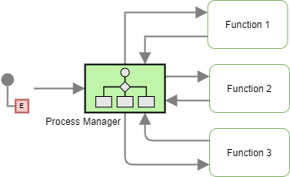
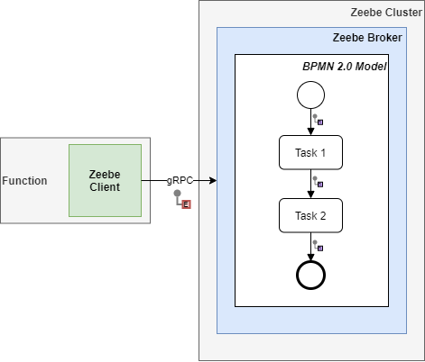

## Table of Contents
- [Table of Contents](#table-of-contents)
- [Patterns](#patterns)
  - [**Process Manager**](#process-manager)
  - [**Event and Document Message**](#event-and-document-message)
- [References](#references)

## Patterns

### **Process Manager**

**Problem**: How does the serverless workflow determine the path in which the message needs to flow if it consists of multiple functions and conditions?

**Decision**: The _Process Manager_ acts as a central processing component for the system. As workflows are influenced by each step's output message, execution states need to be maintained, and based on the result; the succeeding component is invoked.

**Source**: [[Hohpe and Woolf 2004]](#1)

**Pattern**: Enterprise Integration Pattern

**Type**: Construct

**Synonyms**: -

**Mapping**:

<b>AWS Step Functions</b>

<!-- <iframe src="aws_step_functions\process_manager.html"></iframe> -->
States can be orchestrated using ASF State Machine.
 

    

 
<b>ASF snippet</b>:
 
<pre>
  <code>
    {
    "Comment": "ASF Template",
    "StartAt": "Function",
    "States": {
        "Function": {
        "Type": "Pass",
        "End": true
        }
    }
    }
  </code>
</pre>

<b>Zeebe</b>

The "Process Manager" pattern for Zeebe is the broker coordinating the various tasks in the workflow. Here the various tasks are associated with their corresponding hosted function.
 

    

<b>Azure Durable Functions</b>

Here the message routing "Process Manager" pattern for ADF is presented. Here the various functions are orchestrated using the primary Orchestration Function.
 

    

 

----

 

### **Event and Document Message**

**Problem**: How can the serverless workflow and its involved functions be executed/triggered?

**Decision**: External services or clients can invoke the serverless data processing workflow by an _Event Message_. Furthermore, _Event Messages_ can be used to invoke other workflows or services. As functions are considered a black box, the _Document Message_ containing the data structure message is the most optimum choice when communicating between internal states/functions.

**Source**: [[Hohpe and Woolf 2004]](#1)

**Pattern**: Enterprise Integration Pattern

**Type**: Construct

**Synonyms**: -

**Mapping**:

<b>AWS Step Functions</b>

ASF can be triggered using an event message via the API Gateway<a href="#1" id="1">1</a>. The various states in ASF are traversed using a document message that is a JSON structured message.
 

    

<b>Zeebe</b>

In Zeebe, the Event and Document message constructs invoke the workflow and handle the internal communication between elements, respectively. A client can invoke the intermediatory Zeebe client, which in turn invokes the BPMN 2.0 Zeebe workflow via gRPC. Internally, the workflow uses variables and JSON messages to interact with the states.
 

    

<b>Azure Durable Functions</b>

In ADF, the Event message construct invokes the orchestration function, and the Document message handles the internal message communication between the functions.
 

    

## References

<a id="1">[Hohpe and Woolf 2004]</a>
Hohpe, G. and Woolf, B., 2004. Enterprise integration patterns: Designing, building, and deploying messaging solutions. Addison-Wesley Professional.

***
1. https://aws.amazon.com/api-gateway